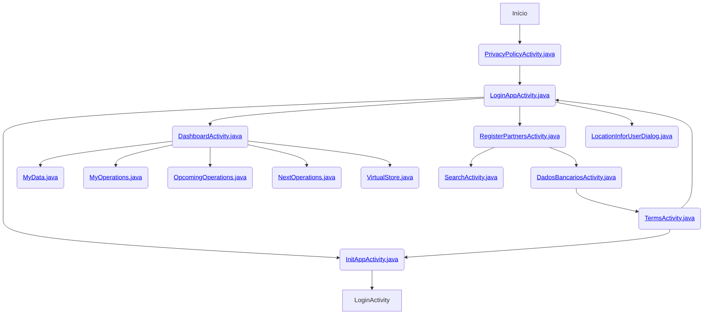

## Mapeamento de telas

```mermaid
graph TD

A[Início]
PrivacyPolicyActivity(<a href='/app/src/main/java/br/com/stilldistribuidora/partners/views/PrivacyPolicyActivity.java'>PrivacyPolicyActivity.java</a>)
InitAppActivity(<a href='/app/src/main/java/br/com/stilldistribuidora/stillrtc/ui/activities/InitAppActivity.java'>InitAppActivity.java</a>)
LoginAppActivity(<a href='/app/src/main/java/br/com/stilldistribuidora/partners/views/LoginAppActivity.java'>LoginAppActivity.java</a>)
DashboardActivity(<a href='/app/src/main/java/br/com/stilldistribuidora/partners/views/DashboardActivity.java'>DashboardActivity.java</a>)
RegisterPartnersActivity(<a href='/app/src/main/java/br/com/stilldistribuidora/partners/views/RegisterPartnersActivity.java'>RegisterPartnersActivity.java</a>)
SearchActivity(<a href='/app/src/main/java/br/com/stilldistribuidora/stillrtc/ui/activities/SearchActivity.java'>SearchActivity.java</a>)

SearchActivity(<a href='/app/src/main/java/br/com/stilldistribuidora/stillrtc/ui/activities/SearchActivity.java'>SearchActivity.java</a>)
DadosBancariosActivity(<a href='/app/src/main/java/br/com/stilldistribuidora/partners/views/DadosBancariosActivity.java'>DadosBancariosActivity.java</a>)
TermsActivity(<a href='/app/src/main/java/br/com/stilldistribuidora/partners/views/TermsActivity.java'>TermsActivity.java</a>)

MyData(<a href='/app/src/main/java/br/com/stilldistribuidora/partners/views/MyData.java'>MyData.java</a>)
MyOperations(<a href='/app/src/main/java/br/com/stilldistribuidora/partners/views/MyOperations.java'>MyOperations.java</a>)
OpcomingOperations(<a href='/app/src/main/java/br/com/stilldistribuidora/partners/views/OpcomingOperations.java'>OpcomingOperations.java</a>)
NextOperations(<a href='/app/src/main/java/br/com/stilldistribuidora/partners/views/NextOperations.java'>NextOperations.java</a>)
VirtualStore(<a href='/app/src/main/java/br/com/stilldistribuidora/partners/views/VirtualStore.java'>VirtualStore.java</a>)
LocationInforUserDialog(<a href='/app/src/main/java/br/com/stilldistribuidora/partners/Base/LocationInforUserDialog.java'>LocationInforUserDialog.java</a>)


    A[Início] --> PrivacyPolicyActivity
    PrivacyPolicyActivity --> LoginAppActivity
    LoginAppActivity --> InitAppActivity
    InitAppActivity --> LoginActivity
    LoginAppActivity --> DashboardActivity
    LoginAppActivity --> RegisterPartnersActivity
    LoginAppActivity --> LocationInforUserDialog
    RegisterPartnersActivity --> SearchActivity
    RegisterPartnersActivity --> DadosBancariosActivity
    DadosBancariosActivity --> TermsActivity
    TermsActivity --> InitAppActivity
    TermsActivity --> LoginAppActivity
    DashboardActivity --> MyData
    DashboardActivity --> MyOperations
    DashboardActivity --> OpcomingOperations
    DashboardActivity --> NextOperations
    DashboardActivity --> VirtualStore
    
```
